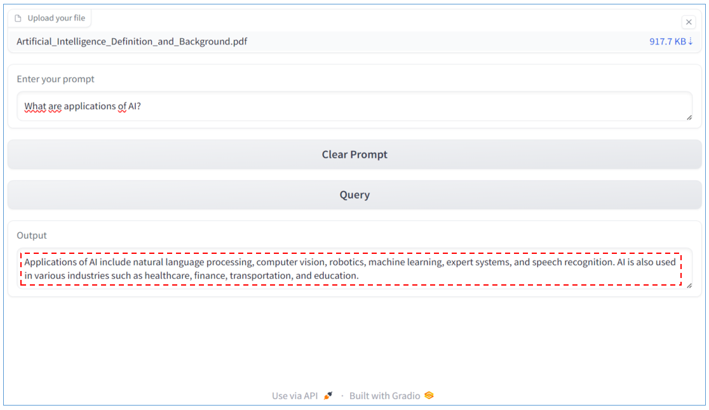

# Q-A_PDF_with_RAG
A project that help query content of a PDF file using RAG from LangChain

## How to run
1. Download file main.ipynb
2. Open file main.ipynb in Google Colab
3. In Google Colab, change runtime type from CPU to GPU
4. Run step-by-step as below:
    * Step 01: Install all required libraries
    * Step 02: Import all required libraries
    * Step 03: Initiate Model
    * Step 04: Run the app with Gradio                              
                         
        

        
